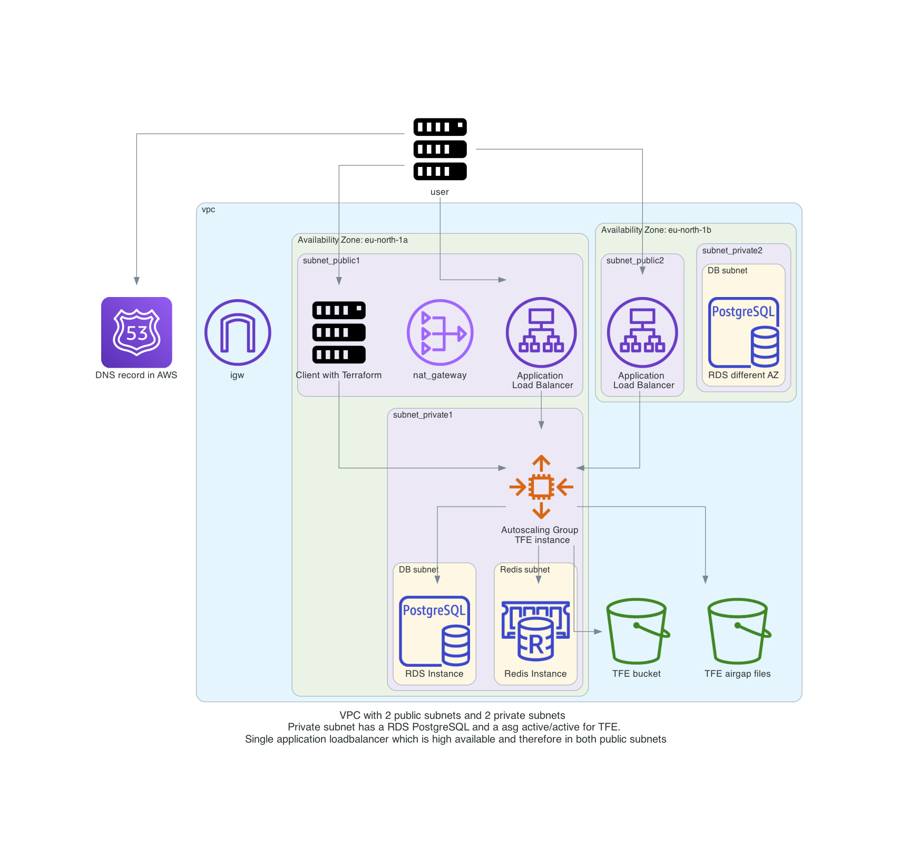

# TFE FDO - Podman installation Active/Active on AWS 
Install Prod External Services ( Redis + S3 + DB ) active-active installation AWS with the Flexible deployment option using Podman. 

This repository is based on the following repositories

With this repository you will be able to do a TFE (Terraform Enterprise) active/active installation on AWS with external services for storage in the form of S3 and PostgreSQL. The server configuration is done by using an autoscaling launch configuration. The TFE instance will be behind a load balancer. 

The Terraform code will do the following steps

- Create S3 buckets used for TFE
- Generate TLS certificates with Let's Encrypt to be used by TFE
- Create a VPC network with subnets, security groups, internet gateway
- Create a RDS PostgreSQL to be used by TFE
- Create an autoscaling launch configuration which defines the TFE instance installation
- An auto scaling group that points to the launch configuration
- Create an application load balancer for communication to TFE
- Create a Redis database
- Create an autoscaling launch configuration which defines the TFE instance and installation active/active
- add a number of x TFE server nodes

# Diagram

Detailed Diagram of the environment:  
  

# Prerequisites

## License
Make sure you have a TFE license available for use

## AWS
We will be using AWS. Make sure you have the following
- AWS account  
- Install AWS cli [See documentation](https://docs.aws.amazon.com/cli/latest/userguide/install-cliv2.html)

## Install terraform  
See the following documentation [How to install Terraform](https://learn.hashicorp.com/tutorials/terraform/install-cli)

## TLS certificate
You need to have valid TLS certificates that can be used with the DNS name you will be using to contact the TFE instance.  
  
The repo assumes you have no certificates and want to create them using Let's Encrypt and that your DNS domain is managed under AWS. 

# How to

## Build TFE active/active environment
- Clone the repository to your local machine
```sh
git clone https://github.com/munnep/tfe_fdo_aws_podman_active-active.git
```
- Go to the directory
```sh
cd tfe_fdo_aws_podman_active-active
```
- Set your AWS credentials
```sh
export AWS_ACCESS_KEY_ID=
export AWS_SECRET_ACCESS_KEY=
export AWS_SESSION_TOKEN=
```
- create a file called `variables.auto.tfvars` with the following contents and your own values. Example will create 2 TFE nodes at the start.  
```hcl
tag_prefix                 = "tfe20"                                    # TAG prefix for names to easily find your AWS resources
region                     = "eu-north-1"                               # Region to create the environment
vpc_cidr                   = "10.221.0.0/16"                            # subnet mask that can be used 
rds_password               = "Password#1"                               # password used for the RDS environment
dns_hostname               = "tfe20"                                    # DNS hostname for the TFE
dns_zonename               = "aws.munnep.com"                           # DNS zone name to be used
tfe_password               = "Password#1"                               # TFE password for the dashboard and encryption of the data
certificate_email          = "patrick.munne@hashicorp.com"              # Your email address used by TLS certificate registration
terraform_client_version   = "1.1.7"                                    # Terraform version you want to have installed on the client machine
public_key                 = "ssh-rsa AAAAB3Nzf"                        # The public key for you to connect to the server over SSH
asg_min_size               = 1                                          # autoscaling group minimal size.
asg_desired_capacity       = 1                                          # autoscaling group desired capacity.
asg_max_size               = 2                                          # autoscaling group maximum size.
tfe_license                = "<your_license>"                           # license key for TFE as string
tfe_release                = "v202502-2"                                # version of TFE you want to install
```
- Terraform initialize
```sh
terraform init
```
- Terraform plan
```sh
terraform plan
```
- Terraform apply
```sh
terraform apply
```
- Terraform output should create 47 resources and show you the public dns string you can use to connect to the TFE instance
```sh
Plan: 47 to add, 0 to change, 0 to destroy.

Outputs:

ssh_tfe_server = tolist([
  "i-04bdf4c29520d0a5e",
  "i-0de4670c09afc125d",
])
tfe_appplication = "https://tfe20.aws.munnep.com"
tfe_server_connection = <<EOT
# Make a connection using doormat. For example
doormat session --account aws_patrick.munne_test --region eu-north-1
EOT
```
- Login to your TFE environment after 5 minutes. 
username: admin
password: <defined in your variables file>
https://tfe20.aws.munnep.com 
- You now have a TFE active/active cluster with a single node. Alter the value to 2 and another apply to scale out
```
asg_min_size               = 2                                          # autoscaling group minimal size.
asg_desired_capacity       = 2                                          # autoscaling group desired capacity.
asg_max_size               = 2                                          # autoscaling group maximum size.
```

## testing

- Go to the directory test_code
```sh
cd test_code
```
- login to your terraform environment just created
```sh
terraform login tfe20.aws.munnep.com
```
- Edit the `main.tf` file with the hostname of your TFE environment
```hcl
terraform {
  cloud {
    hostname = "tfe20.aws.munnep.com"
    organization = "test"

    workspaces {
      name = "test"
    }
  }
}
```
- Run terraform init
```sh
terraform init
```
- run terraform apply
```sh
terraform apply
```
output
```sh
Plan: 1 to add, 0 to change, 0 to destroy.


Do you want to perform these actions in workspace "test-agent"?
  Terraform will perform the actions described above.
  Only 'yes' will be accepted to approve.

  Enter a value: yes

terraform_data.test: Creating...
terraform_data.test: Creation complete after 0s [id=de1c6969-e277-26f1-5434-9020b03ed3fd]

Apply complete! Resources: 1 added, 0 changed, 0 destroyed.
```


# TODO


# DONE

- [x] create VPC
- [x] create 4 subnets, 2 for public network, 2 for private network
- [x] create internet gw and connect to public network with a route table
- [x] create nat gateway, and connect to private network with a route table
- [x] route table association with the subnets 
- [x] security group for allowing port 443 6379 8201
- [x] Generate certificates with Let's Encrypt to use
- [x] import TLS certificate
- [x] create a LB (check Application Load Balancer or Network Load Balancer)
- [x] publish a service over LB TFE dashboard and TFE application
- [x] create DNS CNAME for website to loadbalancer DNS
- [x] adding authorized keys 
- [x] RDS PostgreSQL database
- [x] use standard ubuntu image
- [x] install TFE
- [x] swappiness
- [x] disks
- [x] Auto scaling launch configuration
- [x] Auto scaling group creating
- [x] create a REDIS database environment
- [x] Test the active active environment is able to run workspaces


